# Using Campaign Studio

Live: **https://campaign-studio-a1dk.onrender.com** (free tier: the first request after 15 min idle takes ~1 min).
Demo login: `demo@disconetwork.com` / `disco-demo-2026` — or create your own account (no email confirmation; 100 credits).

## 1. Sign in

Email + password. New accounts get **100 credits**. Credits pay for model calls only: building a campaign ≈ 12–14, rewriting one creative ≈ 3, a feedback fix ≈ 2. Clarity checks, edits, exports and comparisons are free. The balance is always visible top-right and in the sidebar.

## 2. Describe your business

On the **Dashboard**, type one or two sentences about what you sell and to whom, or pick an example chip. Click **Build campaign**.

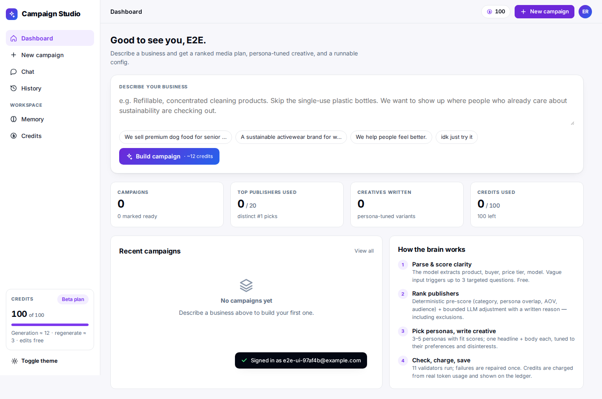

## 3. The clarity gate

Before anything is generated, the brief is scored 0–100 for free.

- **Clear / Usable (≥ 60)** — you see how the brief was read (product, buyer, price tier, model) and can generate.
- **Vague (< 60)** — up to three questions appear. Some are single-choice, some let you pick several (the model decides). Every question must be answered (or typed) before **Generate** unlocks, so a vague brief never produces a confident-looking wrong plan.

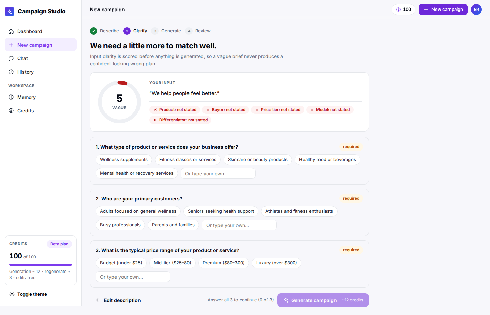

## 4. Generation streams live

Each stage reports as it finishes: parse → score 20 publishers → pick personas → write creative → assemble config → run 11 checks. If a check fails, the auto-repair shows too.

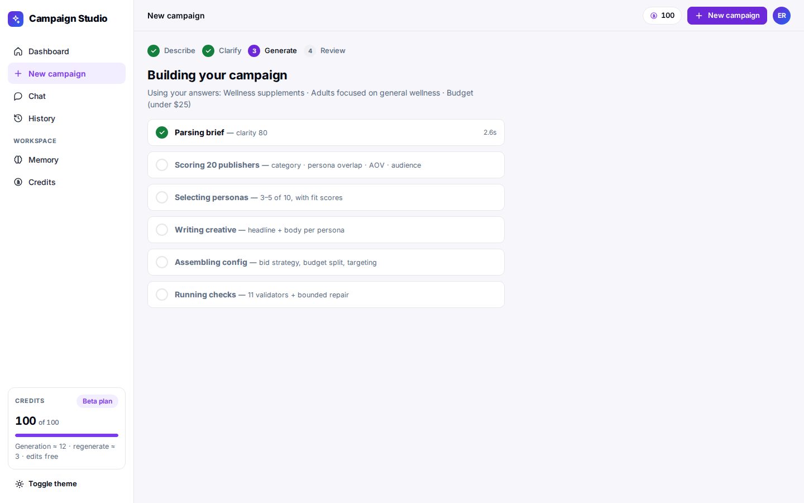

## 5. The campaign page

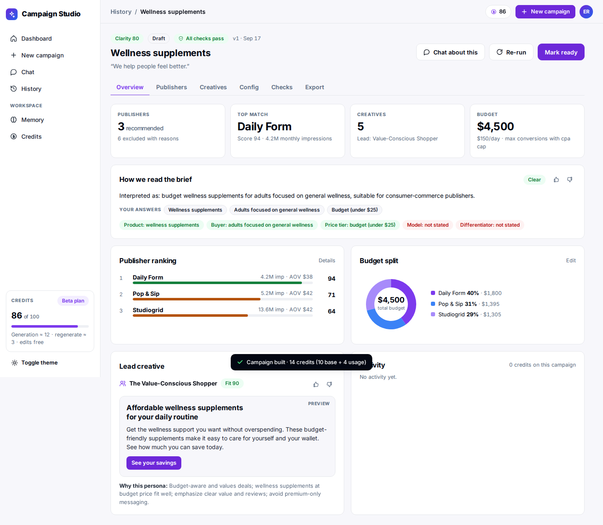

| Tab | What you get | What you can do |
|---|---|---|
| **Overview** | Summary tiles, how the brief was read, ranking bars, budget donut, lead creative, activity timeline with credits per action | 👍/👎 the interpretation, **Mark ready** (blocked while an error-level check fails), **Re-run** |
| **Publishers** | 3–5 recommended, each with a fit score, the deterministic breakdown (category · persona · AOV · audience), the model's adjustment and a written reason quoting the catalog note; plus the most instructive exclusions and why | **Drop** (free; budget re-spreads), 👍/👎 with a note (👎 + note re-ranks that publisher, ~2 credits) |
| **Creatives** | One variant per persona with fit, "why this persona", the angle, what it speaks to / avoids, and **Confirm before running** notes for anything the copy implies that the brief didn't state | **Edit** inline (free), **Regenerate** (~3 credits), 👎 + note ("too clinical, make it warmer") rewrites it, **Add a persona** |
| **Config** | Objective, KPI, bid strategy with rationale, budget/flight, targeting, per-publisher allocation sliders, and the live `campaign_config.json` | Edit and **Save** (free; allocation must total 100%), **Copy JSON** |
| **Checks** | The 11 validators (allocation, caps, reasons, creative lengths, disinterests, brand voice, persona fit floor, budget sanity, banned publishers) | **Fix** a failing check with the tool that owns it |
| **Export** | One-page brief preview | **Download PDF**, **Copy JSON** (what an ad server would ingest) |

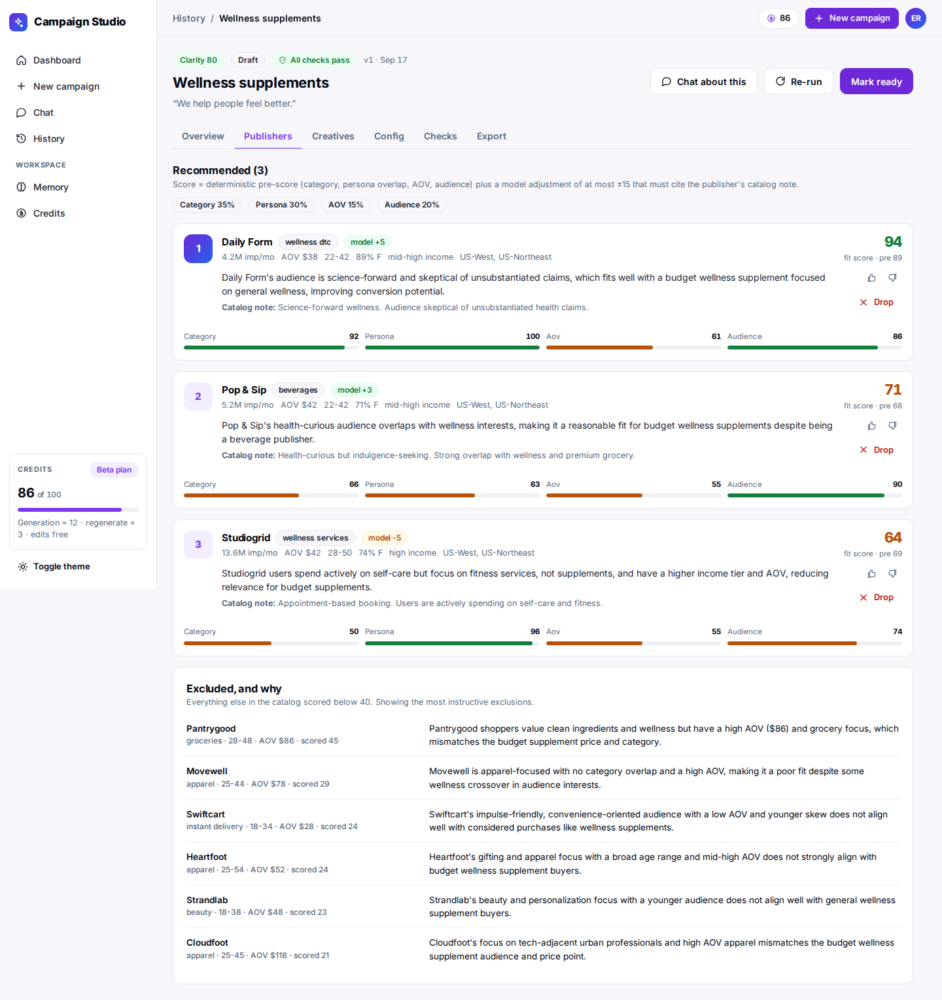
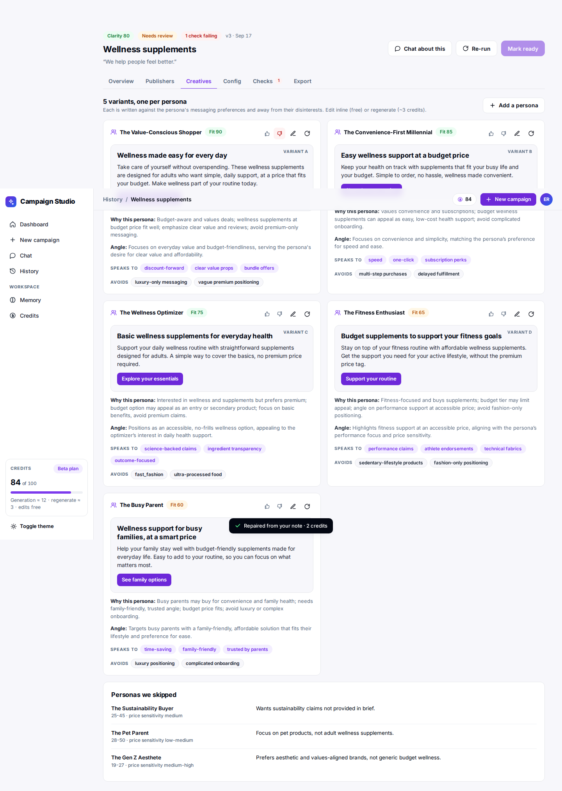
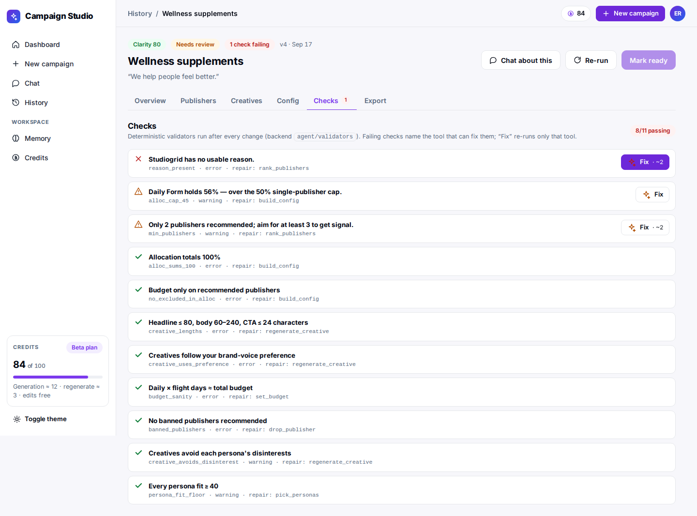

## 6. Chat — the same brain, conversationally

Open **Chat** (or **Chat about this** from a campaign). You can do the whole workflow here: paste a brief, answer the clarifying questions in the card, and the campaign is built in the thread. While the agent works you see what it is doing — a live tree of thoughts and tool cards, not a spinner.

Things to say:

- `Why does the top publisher rank first?` — explained from the actual reasons, free
- `Drop the lowest publisher` · `Raise the budget to $20k` — free, instant
- `Make variant B punchier` — rewrites that creative (~3 credits)
- `Never use Swiftcart` · `Always keep the tone understated, no exclamation marks` — saved to Memory and enforced from then on
- `Remember that our AOV is $85` — saved as a fact for every prompt
- `Export as PDF`
- Out of scope (`Why did our sales drop?`, other ad platforms, images) — the assistant says so and does nothing, free

Threads persist: reopening a campaign's chat restores the conversation and its cards.

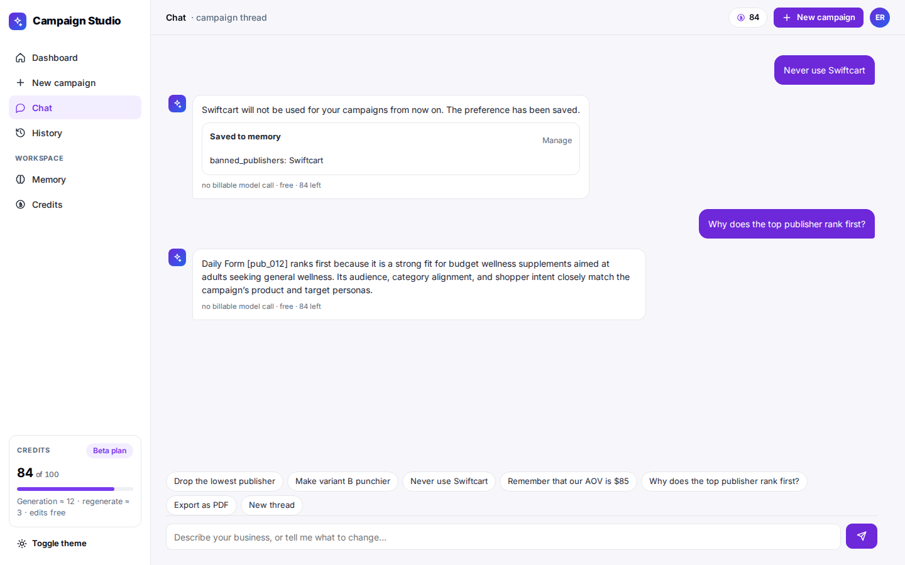

## 7. Memory

**Memory** shows everything the system believes about your brand: brand voice, banned publishers and words, default budget and bid strategy, and free-text facts — with where each came from (manual, chat, feedback). Preferences are hard constraints in every prompt and are enforced by the checks; you can edit or delete any of them.

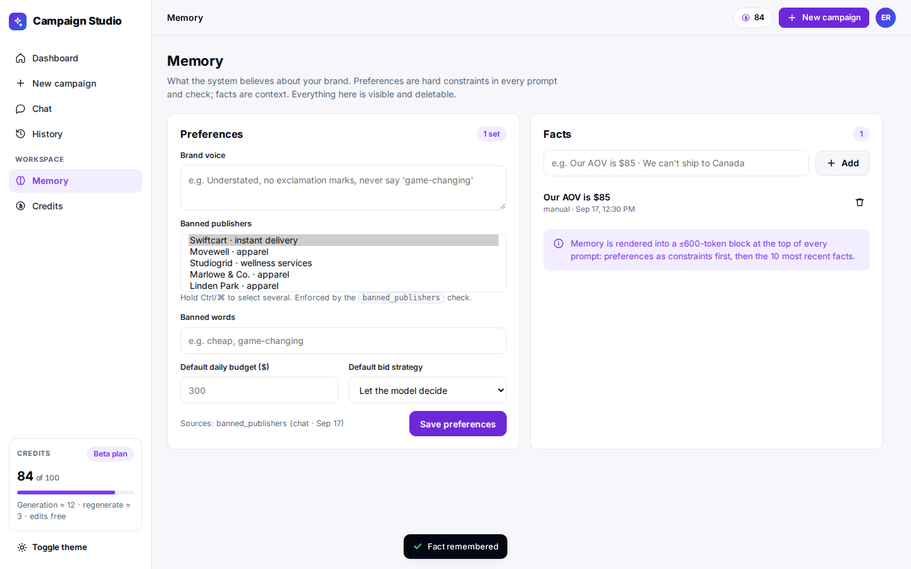

## 8. History and compare

**History** lists every campaign with clarity, top publisher, budget, checks and version. Select two and **Compare** to see publisher score deltas and headline decisions side by side. **Re-run** from a campaign makes a new version you can compare against.

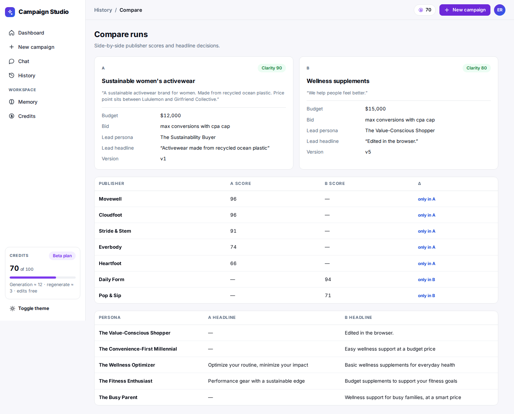

## 9. Credits

**Credits** shows the ledger: every charge with its base fee, token usage and model mix, and the running balance. The ledger always sums to the balance. Model-touching actions are charged from real token usage (1 credit per 4k weighted tokens; the strong model counts 2×); deterministic actions are never charged.

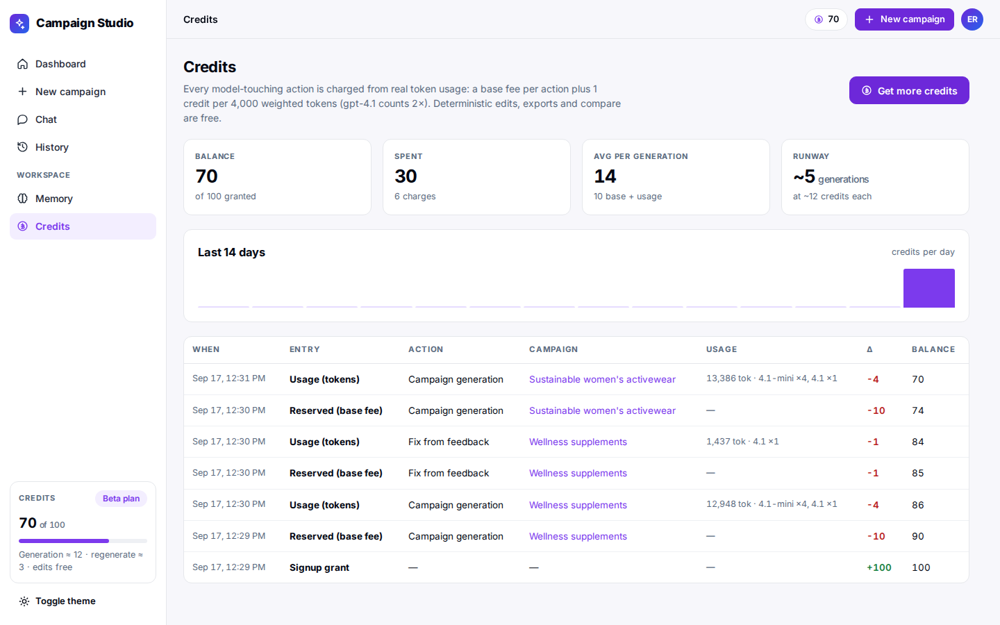

## Tips for reviewers

- Try the three vague examples (`We help people feel better.`, `A new kind of thing for moms.`, `idk just try it`) to see the gate, and the B2B SaaS brief to see an honest off-catalog plan.
- The $650 ski-shell brief shows reasons that respect AOV; the protein-bar brief shows copy that refuses to invent ingredients.
- Every generation is traced in Langfuse (agent → tool → generation → guardrail) when the keys are configured.
