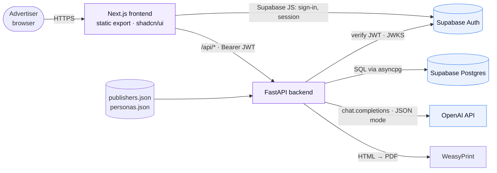
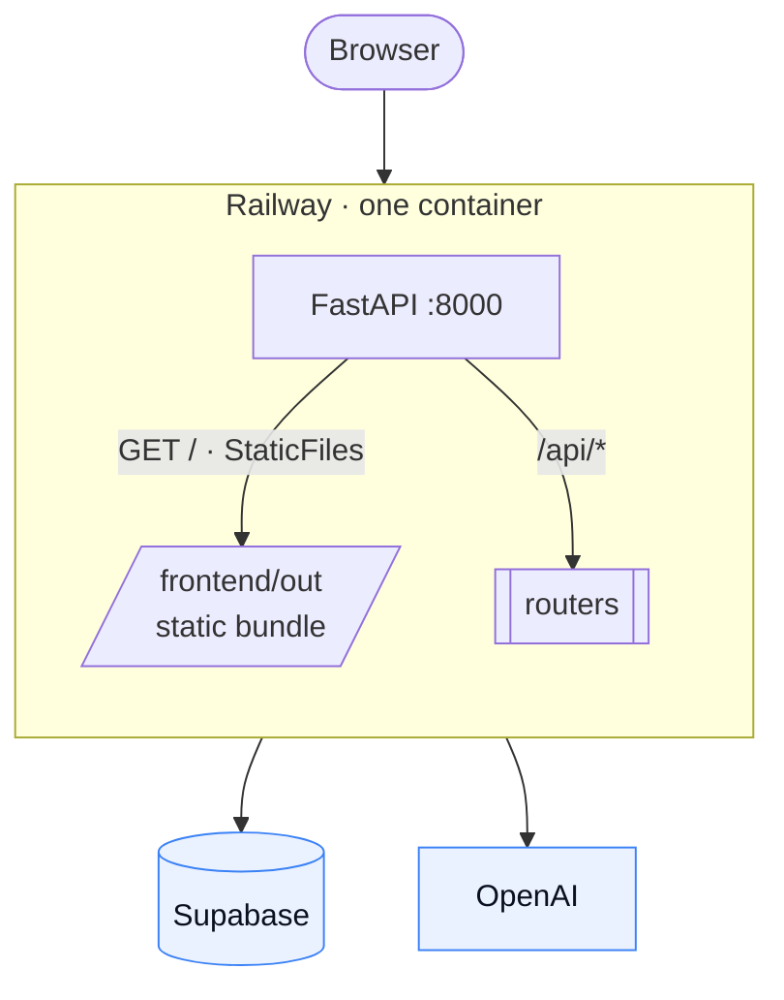
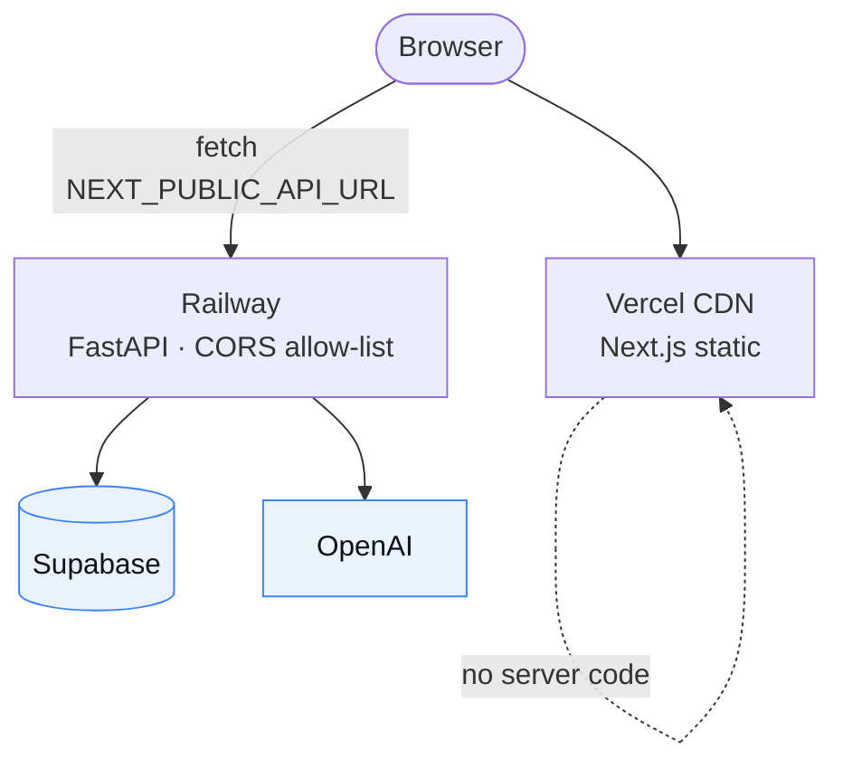
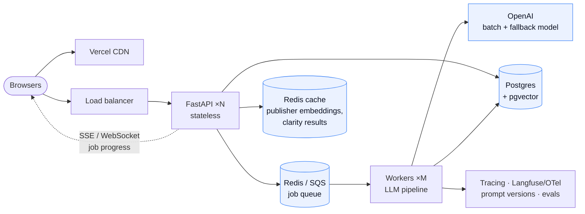
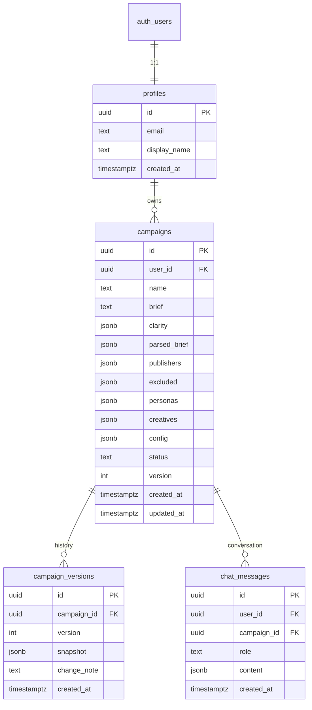

# HLD — Campaign Studio

> Rendered version with full tables: [`hld-blueprint.html`](./hld-blueprint.html). LLD: [`LLD.md`](./LLD.md).

**One sentence.** An advertiser describes their business; Campaign Studio returns *where* to run (ranked publishers with reasons and exclusions), *who* to speak to (persona-tuned creative), and *how* to run it (a structured, editable config) — with the reasoning visible at every step, a credit ledger for every model call, and feedback that repairs the output.

## 1. Product scope

| Req | Requirement (from the brief) | Acceptance |
|---|---|---|
| R1 | Ranked publishers with reasoning | ≥3 recommended with a per-publisher reason and score breakdown; ≥3 exclusions with reasons |
| R2 | 3–5 creative variants, one per persona | Headline ≤80, body 60–240, CTA ≤24 chars; persona fit + "why this persona" shown |
| R3 | Structured campaign config | Objective, KPI, bid strategy + ranges, budget/flight, targeting, allocation summing to 100, creatives linked to placements |
| R4 | Handle messy input | Clarity score <60 triggers ≤3 questions before anything is generated; off-topic briefs get an honest weak-fit plan |
| R5 | Show your work | Every number has a rationale one click away |
| R6 | `prompts/`, one-page README, one-command run | — |

**Additions that make it a product:** login + workspaces (Supabase Auth), input clarity gate, explainable hybrid scoring, history + compare, editable config + PDF/JSON export, chat as an alternate full workflow, **agentic core** (orchestrator · typed tools · validators · repair), **feedback loop** (👍/👎 + comment → targeted repair), **memory** (preferences + facts), **credits** (100 on signup; base fee + usage-based charge per model action).

**Non-goals:** auction/pacing simulation, image creative, orgs/roles, billing top-ups, fine-tuning, playbooks (covered by preferences + re-run).

## 2. Components



| Component | Owns | Does not own |
|---|---|---|
| Next.js frontend (static export, shadcn/ui) | Routing, auth UI, session, rendering, optimistic edits, chat UI | Any LLM call, scoring, or secret |
| FastAPI backend | JWT verification, orchestrator + tools + validators, memory, credits, persistence, PDF, chat | Serving UI in split mode |
| Supabase | Users/sessions, Postgres with RLS | Business logic |
| OpenAI | `gpt-4.1-mini` for clarity/ranking/personas/config; `gpt-4.1` for creative and the chat planner | — |

## 3. Deployment shapes (one codebase)

The only variables are `NEXT_PUBLIC_API_URL` (empty = same origin) and whether FastAPI mounts the static bundle.

**Shape A — single service (Railway free tier).** Multi-stage Dockerfile builds the Next.js export and copies it into the Python image; FastAPI serves `/` from `frontend/out` and the API at `/api/*`. Same origin → no CORS.



**Shape B — split (Vercel + Railway).** Frontend on Vercel's CDN, backend on Railway with a CORS allow-list. Preview deployments per PR.



*Why static export, not SSR/BFF:* nothing needs server rendering — auth is client-side Supabase and all data is per-user after login. Static export lets one Python process serve everything in Shape A and pure files in Shape B.

## 4. Scale-out (secondary)



| Concern | Prototype | At scale |
|---|---|---|
| Generation latency (8–15 s) | Synchronous + SSE stage events | Job queue + workers; idempotency key per run |
| Publisher matching | 20 publishers, in-memory | pgvector recall (top-50) → deterministic + LLM rerank |
| Cost | ~5 LLM calls/run | Cache clarity by input hash; cheaper model for scoring; batch creatives |
| Quality | Manual review | Golden-set evals in CI (NDCG vs labels, LLM-judge copy rubric), prompt versioning |
| Reliability | Retry with backoff | Model fallback, circuit breaker, DLQ, per-user rate limits |

## 5. Generation pipeline

```mermaid
sequenceDiagram
  autonumber
  participant FE as Frontend
  participant API as FastAPI
  participant S as services/*
  participant LLM as OpenAI
  participant DB as Postgres
  FE->>API: POST /api/clarity {brief}
  API->>S: clarity.score(brief)
  S->>LLM: clarity.md · JSON mode
  LLM-->>S: {score, signals[], questions[]?, parsed_brief}
  S-->>FE: 200 {score:24, questions:[…]}
  Note over FE: score < 60 → ask questions (chips)
  FE->>API: POST /api/campaigns {brief, answers[]}
  API->>S: pipeline.run()
  S->>S: scoring.prescore(parsed_brief, catalog) — pure Python
  S->>LLM: rank.md (top-10 prescored + notes) → adjust ±15, reasons, exclusions
  S->>LLM: personas.md → 3–5 personas, fit, why
  S->>LLM: creative.md → variants (one call, all personas)
  S->>S: config_builder.build() — rules; LLM writes bid rationale
  S->>DB: insert campaign + version 1
  API-->>FE: SSE stage events, then 201 {campaign}
```

**Hybrid scoring.** `score = 0.35·category + 0.30·persona + 0.15·aov + 0.20·audience`, each 0–100 and deterministic (unit-tested). The LLM adjusts by at most ±15 and must cite a catalog note; anything <40 after adjustment is excluded. This makes rankings reproducible and cheap, and leaves judgment (e.g. "audience skeptical of unsubstantiated health claims") to the model.

## 6. Data model (summary)



Generated artifacts are JSONB validated by Pydantic on write; every edit snapshots a version; RLS on every table. Full model incl. threads, interactions, validation results, feedback, preferences, facts and the credit ledger is in [`LLD.md`](./LLD.md#9-data-model).

## 7. Design language

Lifted from disconetwork.com (itself a shadcn/Tailwind site): Inter; primary purple `hsl(262 83% 58%)`; accent blue `hsl(217 91% 60%)`; 135° purple→blue gradient for brand moments only; white ground, `hsl(224 71% 4%)` ink and dark ground. Semantic green/amber/red for scores is separate from the brand accent. Filled controls use a darker purple (`#6D28D9`) so white text passes WCAG AA in both themes.

## 8. Build order and cuts

1. Backend skeleton + deterministic scoring with tests · 2. Agent core (registry, tools, validators, memory, credits) + prompts · 3. Frontend (login, wizard, campaign tabs, history, memory, credits) · 4. Chat + feedback + PDF · 5. Deploy (Shape A on Railway; Vercel project for Shape B) + README.

Cut on purpose: image creative, A/B simulation, real CPM data, orgs/roles, vector search, PPTX export, playbooks.
