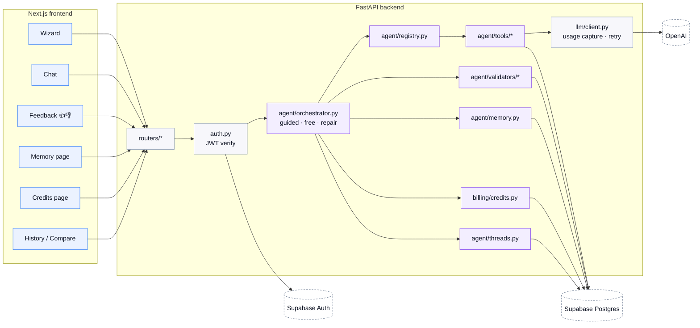
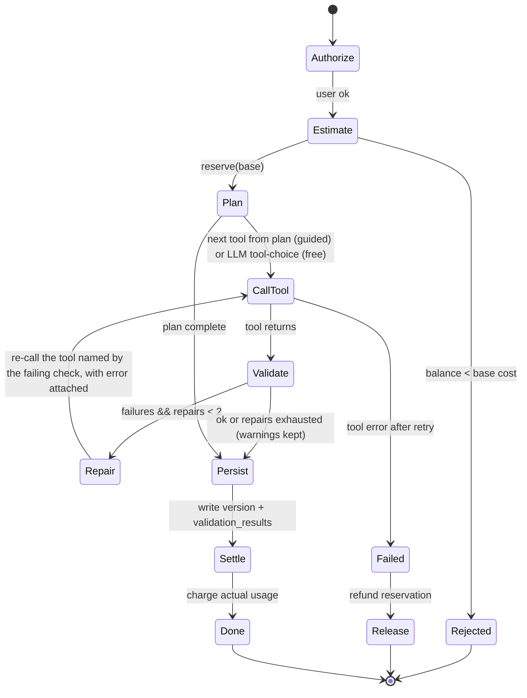
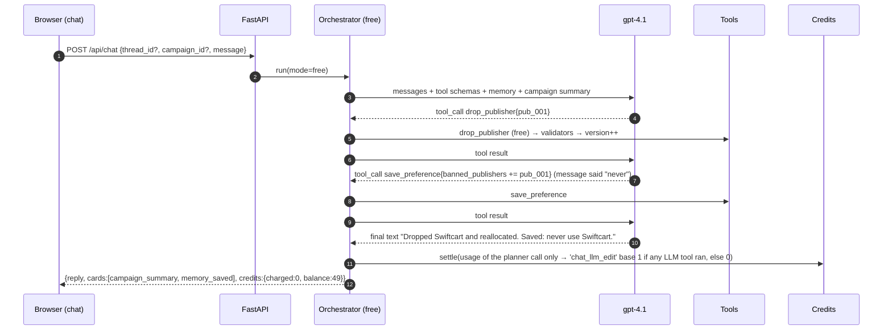
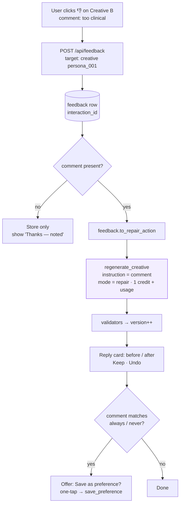
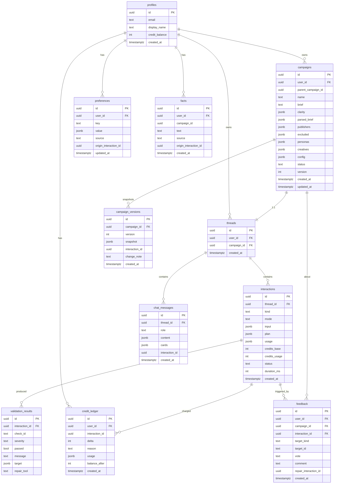

# LLD — Campaign Studio (v2, agentic)

> Rendered version with full tables: [`lld.html`](./lld.html). HLD: [`HLD.md`](./HLD.md).

Every user action that touches the model is an **interaction** inside a **thread** (one thread per campaign). The wizard, the chat and the feedback buttons are three front doors into one **orchestrator**, which only calls typed **tools**, then runs **validators**, then **charges credits** from real token usage, then persists a **version**.

## 1. System overview



```
backend/app/
  main.py  config.py  auth.py  db.py  catalog.py
  llm/        client.py (JSON-schema mode, retry, returns (parsed, Usage))  usage.py (per-interaction accumulator)
  agent/      orchestrator.py  registry.py  tools/*  validators/*  memory.py  feedback.py  threads.py  prompts.py
  billing/    credits.py (estimate · reserve · settle · release · ledger)  pricing.py
  services/   scoring.py (deterministic prescore)  config_builder.py  export_pdf.py
  routers/    me  campaigns  chat  feedback  memory  credits  export
  schemas/    Pydantic v2 domain models shared by tools, DB rows and API
```

## 2. Agent core



| Mode | Entered from | Who picks tools | Plan |
|---|---|---|---|
| `guided` | Wizard "Generate" | Code | `prescore_publishers → rank_publishers → pick_personas → write_creatives → build_config` |
| `free` | Chat message | LLM function calling, ≤6 calls/turn | Emergent; system prompt has tools, memory, campaign summary |
| `repair` | 👎 with comment, or validator failure | Code maps target → one tool | Single call with `instruction` |

```python
class AgentCtx(BaseModel):
    user: UserCtx; thread_id: UUID; interaction_id: UUID
    campaign: Campaign | None          # mutated through tools
    memory: MemoryBlock                # preferences + facts, rendered for prompts (≤600 tokens)
    catalog: Catalog                   # publishers, personas, adjacency table
    usage: UsageAccumulator            # every LLM call adds tokens
    emit: Callable[[StageEvent], None] # SSE progress
```

## 3. Tool registry

```python
class Tool(Generic[I, O]):
    name: str; description: str; Input: type[I]; Output: type[O]
    cost: Cost          # Cost(base=10, usage=True) | Cost.free()
    mutates: bool       # True → version++ and validators run
    async def run(self, ctx: AgentCtx, inp: I) -> O: ...
```

| Tool | LLM | Cost | Mutates | Notes |
|---|---|---|---|---|
| `score_clarity` | 4.1-mini | free | no | cached by sha256(brief+answers) 24 h |
| `prescore_publishers` | — | free | no | pure Python, unit-tested |
| `rank_publishers` | 4.1-mini | usage | yes | delta bounded ±15, must cite a catalog note |
| `pick_personas` | 4.1-mini | usage | yes | 3–5 personas, fit 0–100, why |
| `write_creatives` | 4.1 | usage ×2 | yes | one call for all; brand-voice preferences are hard constraints |
| `build_config` | 4.1-mini (rationale) | usage | yes | allocation = fit × log(reach), cap 45%, normalise to 100 |
| `generate_campaign` | composite | base 10 + usage | yes | chat-facing wrapper for the guided plan |
| `regenerate_creative` | 4.1 | base 2 + usage | yes | previous headline passed as "avoid" |
| `drop_publisher` · `set_budget` · `update_creative` | — | free | yes | deterministic edits |
| `save_preference` · `remember_fact` · `export_brief` | — | free | no | memory + export |

## 4. Validators and repair

Pure `(Campaign, Catalog) → ValidationResult`; run after every mutating tool; stored per interaction; shown as the **Checks** panel. A failing check names its repair tool; the orchestrator re-calls it once with the failure text as `instruction` (≤2 repairs per interaction, inside the same credit charge). If errors remain, the campaign is saved as `needs_review` — never nothing.

| Check | Rule | Severity | Repair |
|---|---|---|---|
| `alloc_sums_100` | Σ pct == 100 | error | build_config |
| `alloc_cap_45` | no publisher >45% (unless only one) | warning | build_config |
| `no_excluded_in_alloc` | allocation ids ⊆ recommended | error | build_config |
| `min_publishers` | ≥3 recommended | warning | rank_publishers |
| `reason_present` | every reason ≥40 chars | error | rank_publishers |
| `creative_lengths` | headline ≤80, body 60–240, CTA ≤24 | error | regenerate_creative |
| `creative_avoids_disinterest` | no persona `disinterested_in` term in its creative | warning | regenerate_creative |
| `creative_uses_preference` | brand-voice preferences respected | error | regenerate_creative |
| `persona_fit_floor` | fit ≥40 | warning | pick_personas |
| `budget_sanity` | daily × days ≈ total (±10%) | error | set_budget |
| `banned_publishers` | none of `preferences.banned_publishers` recommended | error | drop_publisher |

## 5. Memory

| Kind | Examples | Set by | Used by |
|---|---|---|---|
| Preference (typed key) | `brand_voice`, `banned_publishers[]`, `default_daily_budget`, `bid_strategy_default` | Memory page; chat "always/never"; 👎 → "save as preference?" | write_creatives (constraint), rank_publishers (ban), build_config (defaults), validators |
| Fact (free text, scoped) | "Our AOV is $85", "Launch is Nov 15" | chat "remember that…"; Memory page | all prompts via `memory.render()` |

Extraction is regex-based (`always|never|remember that|from now on|our (aov|budget|price|launch)`) — no LLM in the hot path; the reply ends with "Saved to memory: …" and an undo link. Everything is listed with its source and deletable.

## 6. Credits

```python
SIGNUP_GRANT = 100; TOKENS_PER_CREDIT = 4_000
MODEL_WEIGHT = {"gpt-4.1-mini": 1.0, "gpt-4.1": 2.0}
BASE = {"generate_campaign": 10, "regenerate_creative": 2, "chat_llm_edit": 1, "feedback_repair": 1}
def tokens_to_credits(usage): return ceil(sum(u.total_tokens * MODEL_WEIGHT[u.model] for u in usage.calls) / TOKENS_PER_CREDIT)
```

```mermaid
sequenceDiagram
  autonumber
  participant O as Orchestrator
  participant C as billing/credits.py
  participant DB as Postgres
  O->>C: estimate(action) → base, est_usage
  O->>C: reserve(user, interaction, base)
  C->>DB: BEGIN; SELECT credit_balance FROM profiles WHERE id=$1 FOR UPDATE
  alt balance < base
    C-->>O: InsufficientCredits(balance, needed)
    O-->>O: abort → 402
  else
    C->>DB: INSERT credit_ledger(delta=-base, reason='reserve', interaction_id)
    C->>DB: UPDATE profiles SET credit_balance = credit_balance - base; COMMIT
  end
  O->>O: run tools (usage accumulates)
  O->>C: settle(interaction, usage)
  C->>DB: INSERT credit_ledger(delta=-tokens_to_credits(usage), reason='usage', usage jsonb)
  C->>DB: UPDATE profiles.credit_balance
  Note over O,C: on failure: release(interaction) inserts +base with reason='refund'
```

Ledger is the source of truth (`SUM(delta) == profiles.credit_balance` asserted in tests); balance is denormalised and locked with `FOR UPDATE`. Deterministic tools never touch billing, so an out-of-credits user can still edit, drop, export and compare. `GET /api/credits/estimate?action=…` feeds the "~12 credits · 61 left" preview on every paid button.

## 7. Touchpoint flows

### 7.1 Sign-in
```mermaid
sequenceDiagram
  autonumber
  participant B as Browser
  participant SB as Supabase Auth
  participant API as FastAPI
  participant DB as Postgres
  B->>SB: signUp / signInWithPassword / signInWithOAuth(google)
  SB-->>B: session {access_token (JWT), refresh_token}
  B->>API: GET /api/me  (Authorization: Bearer JWT)
  API->>API: verify HS256 with SUPABASE_JWT_SECRET; exp; aud="authenticated"
  API->>DB: INSERT profiles ON CONFLICT DO NOTHING; if inserted → INSERT credit_ledger(+100,'signup_grant')
  API-->>B: {user, credit_balance:100, preferences_count, campaigns_count}
  B->>B: store session (Supabase SDK) → route to /dashboard
```

### 7.2 Wizard
```mermaid
sequenceDiagram
  autonumber
  participant B as Browser (wizard)
  participant API as FastAPI
  participant O as Orchestrator
  participant T as Tools
  participant V as Validators
  participant C as Credits
  participant DB as Postgres
  B->>API: POST /api/clarity {brief}
  API->>T: score_clarity (free, cached)
  T-->>B: {score, label, signals, questions[], parsed_brief}
  alt score < 60
    B->>B: render question chips; user answers
    B->>API: POST /api/clarity {brief, answers}
    API-->>B: {score ≥ 60, resolved_summary}
  end
  B->>API: GET /api/credits/estimate?action=generate_campaign
  API-->>B: {base:10, est_usage:2, balance:61}  → button "Generate · ~12 credits"
  B->>API: POST /api/campaigns {brief, answers}  Accept: text/event-stream
  API->>DB: create thread + interaction(kind='generate')
  API->>C: reserve(10)
  API->>O: run(mode=guided)
  loop each plan step
    O->>T: tool.run(ctx)
    O-->>B: SSE stage {name, status:'done', ms}
  end
  O->>V: run_all(campaign)
  opt failures
    O->>T: repair tool (≤2)
  end
  O->>DB: INSERT campaigns + campaign_versions(v1) + validation_results
  O->>C: settle(usage)
  O-->>B: SSE done {campaign_id, credits_charged:12, balance:49}
  B->>B: route to /campaigns/{id}
```

### 7.3 Campaign page edits
| Action | Request | Tool | Credits | UI |
|---|---|---|---|---|
| Drop publisher | `PATCH {op:"drop_publisher"}` | drop_publisher | 0 | optimistic; allocation re-renders |
| Edit creative text | `PATCH {op:"update_creative"}` | update_creative | 0 | inline editor with counters; validator warnings under the card |
| Regenerate creative | `POST …/creatives/{persona}/regenerate` | regenerate_creative | 2 + usage | cost preview; Undo restores previous version |
| Save config | `PATCH {op:"set_config"}` | set_config | 0 | blocked unless allocation = 100 |
| Mark ready | `PATCH {op:"set_status"}` | — | 0 | disabled while any error check fails |

Every PATCH opens an interaction, bumps `version`, snapshots to `campaign_versions`, and returns `{campaign, validation, credits}`.

### 7.4 Chat (free mode)


### 7.5 Feedback


| Target | Repair | Instruction |
|---|---|---|
| Publisher rank/reason | `rank_publishers(focus=[id])` | comment + "re-evaluate only this publisher" |
| Creative | `regenerate_creative` | comment |
| Persona choice | `pick_personas(exclude=[id])` | comment |
| Config / bid rationale | `build_config` | comment |
| Clarity interpretation | `score_clarity` with comment as an extra answer | offered, not automatic |

### 7.6–7.9 Memory page, Credits page, Export, History/Compare
- `GET/POST/DELETE /api/memory/…` — preferences and facts with `source` and `origin_interaction_id`.
- `GET /api/credits` — `{balance, ledger[]}`; sidebar pill updates from every mutating response.
- Export: ```mermaid
sequenceDiagram
  participant B as Browser
  participant API as FastAPI
  participant X as export_pdf.py
  B->>API: GET /api/campaigns/{id}/export.pdf
  API->>X: render(campaign, validation, user) → Jinja2 brief.html
  X->>X: WeasyPrint HTML→PDF (≈300 ms)
  X-->>B: application/pdf, Content-Disposition: attachment; filename=<slug>-brief-v<n>.pdf
  B->>API: GET /api/campaigns/{id}/export.json
  API-->>B: CampaignConfig schema v1 (same object the Config tab shows)
```
- Compare: `GET /api/campaigns/{a}/compare/{b}?va=&vb=` → publisher score deltas, added/removed, creative and config diffs; re-run sets `parent_campaign_id`.

## 8. API contract

| Endpoint | Body / params | Response | Errors |
|---|---|---|---|
| `GET /api/me` | — | profile + balance | 401 |
| `POST /api/clarity` | `{brief, answers?}` | ClarityResult | 422 |
| `POST /api/campaigns` | `{brief, answers?, parent_campaign_id?}` (+ `Accept: text/event-stream`) | SSE stages then Campaign | 402 · 409 clarity_too_low · 502 |
| `GET /api/campaigns` · `/{id}` · `/{id}/versions` | — | list / Campaign / versions | 404 |
| `PATCH /api/campaigns/{id}` | `{op, …}` | `{campaign, validation, credits}` | 409 · 422 |
| `POST /api/campaigns/{id}/creatives/{persona_id}/regenerate` | `{instruction?}` | same | 402 |
| `GET /api/campaigns/{a}/compare/{b}` | `?va=&vb=` | Diff | 404 |
| `GET /api/campaigns/{id}/export.pdf\|json` | — | file | 404 |
| `POST /api/chat` | `{thread_id?, campaign_id?, message}` | `{thread_id, reply, cards[], credits}` | 402 · 429 |
| `POST /api/feedback` | `{campaign_id, target, vote, comment?}` | `{feedback_id, repair?}` | 402 |
| `GET/POST/DELETE /api/memory/…` | — | MemoryBlock | 422 |
| `GET /api/credits` · `/estimate` | `?action=` | ledger / estimate | — |
| `GET /healthz` | — | `{ok, db, openai}` | 503 |

## 9. Data model



Indexes: `campaigns(user_id, created_at desc)`, `interactions(thread_id, created_at)`, `credit_ledger(user_id, created_at desc)`, `preferences(user_id, key) unique`. RLS on every table. **Interactions are the audit spine** — versions, validation results, credits, feedback and chat messages all hang off `interaction_id`.

## 10. Frontend internals

```
frontend/app/(auth)/login · (app)/{dashboard,new,campaigns/[id],chat,history,compare,memory,credits}
components/campaign/{PublisherCard,CreativeCard,ConfigForm,BudgetDonut,ClarityMeter,ChecksPanel,FeedbackButtons}
components/chat/{MessageList,Composer,cards/*}   components/credits/{CreditPill,CostPreview,LedgerTable}
lib/api.ts (bearer, error envelope, SSE)  lib/queries.ts (TanStack Query)  lib/types.ts (from /openapi.json)  lib/store.ts (zustand, UI only)
```
One mutation hook wraps every PATCH/regenerate/feedback call: optimistic where safe, rollback on error, writes `validation` + `credits` into the caches.

## 11. Errors, limits, observability

| Situation | Backend | User sees |
|---|---|---|
| OpenAI timeout/5xx | retry ×2 (0.8 s, 2 s) → `502`; reservation refunded | "The model is busy — nothing was charged." |
| Invalid LLM JSON | one re-ask with the validation error, then fail the tool | same, with the step named |
| Insufficient credits | `402` before any LLM call | paid buttons disabled with balance |
| Clarity <60 posted to generate | `409` with questions | wizard returns to Clarify |
| Chat tool loop >6 | stop, reply with progress | "I stopped after 6 steps — here's where we are." |
| Rate limit | 10 generate/min, 60 chat/min per user | toast with retry-after |

Structured logs per interaction (`kind, mode, tools[], usage, credits, duration_ms, validation_summary`); prompt `version` stored on each interaction.

## 12. Testing

Unit (scoring golden cases, every validator pass/fail, billing invariants on a Postgres test container) · Integration with recorded LLM fixtures for the 15 example briefs · Orchestrator free-mode scripted tool sequences · One Playwright E2E (sign up → generate → 👎 → undo → export → compare) against the Shape A container.

The prototype in `design/prototype/` already carries the client-side twins of validators, credits, memory and feedback repair, exercised by `tools/smoke_prototype.py`.
